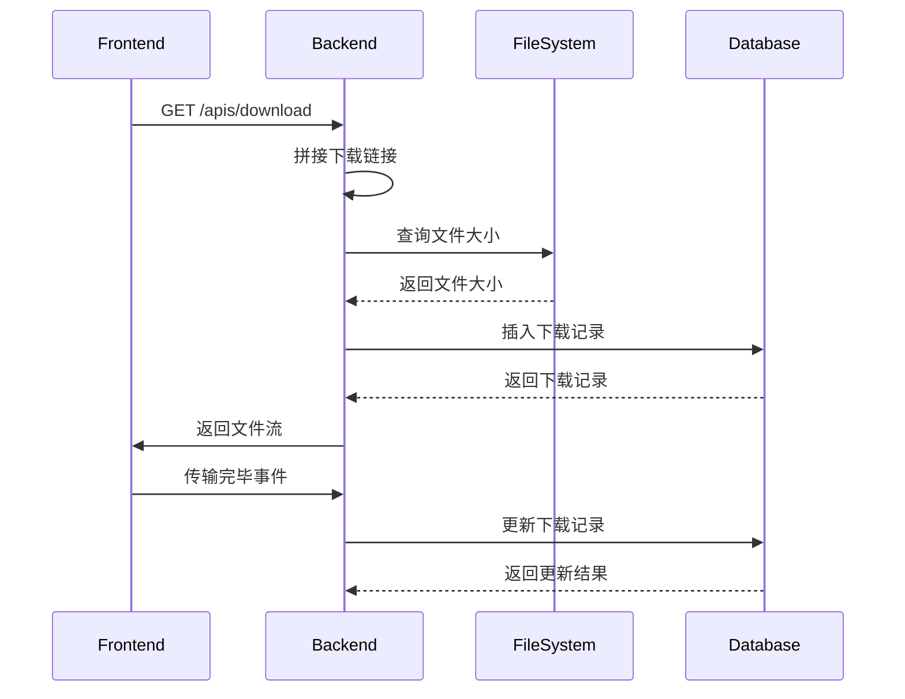

```mermaid
sequenceDiagram
    participant Frontend
    participant Backend
    participant FileSystem
    participant Database
    Frontend ->> Backend: GET /apis/download
    Backend ->> Backend: 拼接下载链接
    Backend ->> FileSystem: 查询文件大小
    FileSystem -->> Backend: 返回文件大小
    Backend ->> Database: 插入下载记录
    Database -->> Backend: 返回下载记录
    Backend ->> Frontend: 返回文件流
    Frontend ->> Backend: 传输完毕事件
    Backend ->> Database: 更新下载记录
    Database -->> Backend: 返回更新结果
```
