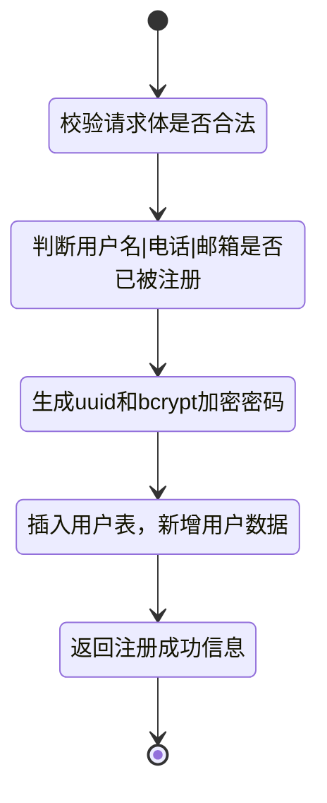

```mermaid
stateDiagram
    [*] --> 校验请求体是否合法
    校验请求体是否合法 --> 判断用户名|电话|邮箱是否已被注册
    判断用户名|电话|邮箱是否已被注册 --> 生成uuid和bcrypt加密密码
    生成uuid和bcrypt加密密码 --> 插入用户表，新增用户数据
    插入用户表，新增用户数据 --> 返回注册成功信息
    返回注册成功信息 --> [*]
```
