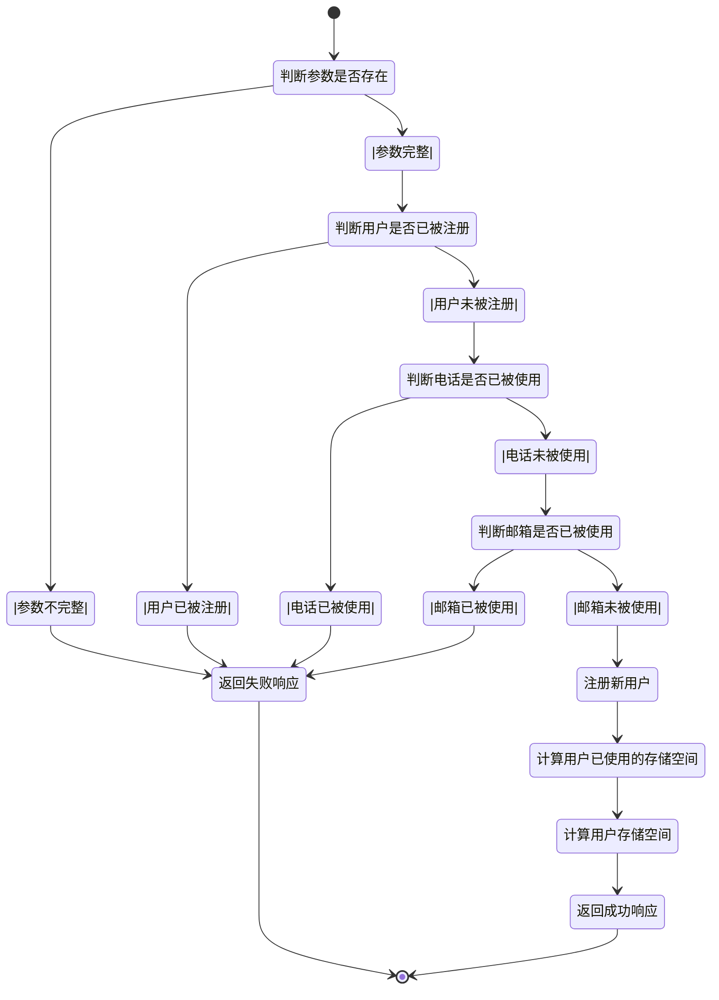

```mermaid
stateDiagram
    [*] --> 判断参数是否存在
    判断参数是否存在 -->|参数不完整|
    |参数不完整| --> 返回失败响应
    判断参数是否存在 -->|参数完整|
    |参数完整| --> 判断用户是否已被注册
    判断用户是否已被注册 -->|用户已被注册|
    |用户已被注册| --> 返回失败响应
    判断用户是否已被注册 -->|用户未被注册|
    |用户未被注册| --> 判断电话是否已被使用
    判断电话是否已被使用 -->|电话已被使用|
    |电话已被使用| --> 返回失败响应
    判断电话是否已被使用 -->|电话未被使用|
    |电话未被使用| --> 判断邮箱是否已被使用
    判断邮箱是否已被使用 -->|邮箱已被使用|
    |邮箱已被使用| --> 返回失败响应
    判断邮箱是否已被使用 -->|邮箱未被使用|
    |邮箱未被使用| --> 注册新用户
    注册新用户 --> 计算用户已使用的存储空间
    计算用户已使用的存储空间 --> 计算用户存储空间
    计算用户存储空间 --> 返回成功响应
    返回成功响应 --> [*]
    返回失败响应 --> [*]
```
