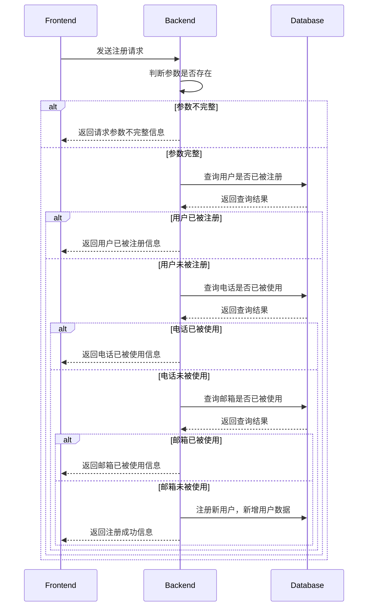

```mermaid
sequenceDiagram
    participant Frontend
    participant Backend
    participant Database
    Frontend->>Backend: 发送注册请求
    Backend->>Backend: 判断参数是否存在
    alt 参数不完整
        Backend-->>Frontend: 返回请求参数不完整信息
    else 参数完整
        Backend->>Database: 查询用户是否已被注册
        Database-->>Backend: 返回查询结果
        alt 用户已被注册
            Backend-->>Frontend: 返回用户已被注册信息
        else 用户未被注册
            Backend->>Database: 查询电话是否已被使用
            Database-->>Backend: 返回查询结果
            alt 电话已被使用
                Backend-->>Frontend: 返回电话已被使用信息
            else 电话未被使用
                Backend->>Database: 查询邮箱是否已被使用
                Database-->>Backend: 返回查询结果
                alt 邮箱已被使用
                    Backend-->>Frontend: 返回邮箱已被使用信息
                else 邮箱未被使用
                    Backend->>Database: 注册新用户，新增用户数据
                    Backend-->>Frontend: 返回注册成功信息
                end
            end
        end
    end


```
