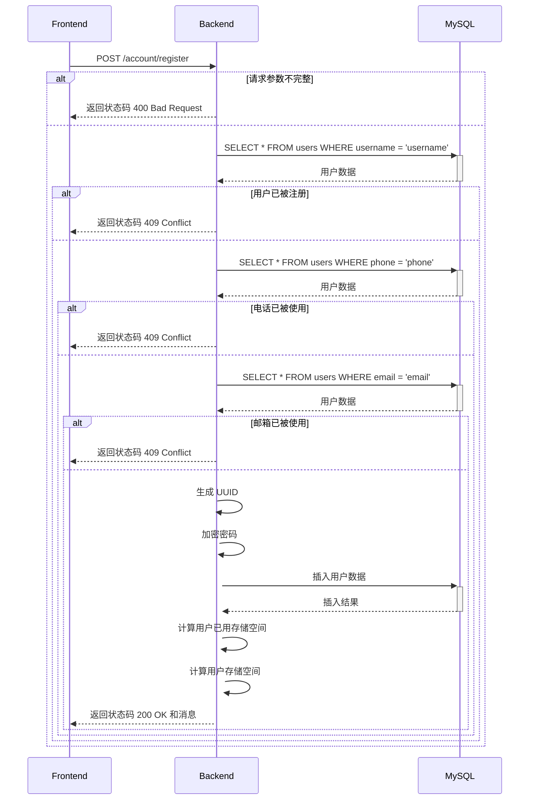

```mermaid
sequenceDiagram
    participant Frontend
    participant Backend
    participant MySQL

    Frontend->>Backend: POST /account/register
    alt 请求参数不完整
        Backend-->>Frontend: 返回状态码 400 Bad Request
    else
        Backend->>+MySQL: SELECT * FROM users WHERE username = 'username'
        MySQL-->>-Backend: 用户数据
        alt 用户已被注册
            Backend-->>Frontend: 返回状态码 409 Conflict
        else
            Backend->>+MySQL: SELECT * FROM users WHERE phone = 'phone'
            MySQL-->>-Backend: 用户数据
            alt 电话已被使用
                Backend-->>Frontend: 返回状态码 409 Conflict
            else
                Backend->>+MySQL: SELECT * FROM users WHERE email = 'email'
                MySQL-->>-Backend: 用户数据
                alt 邮箱已被使用
                    Backend-->>Frontend: 返回状态码 409 Conflict
                else
                    Backend->>+Backend: 生成 UUID
                    Backend->>+Backend: 加密密码
                    Backend->>+MySQL: 插入用户数据
                    MySQL-->>-Backend: 插入结果
                    Backend->>+Backend: 计算用户已用存储空间
                    Backend->>+Backend: 计算用户存储空间
                    Backend-->>Frontend: 返回状态码 200 OK 和消息
                end
            end
        end
    end


```
