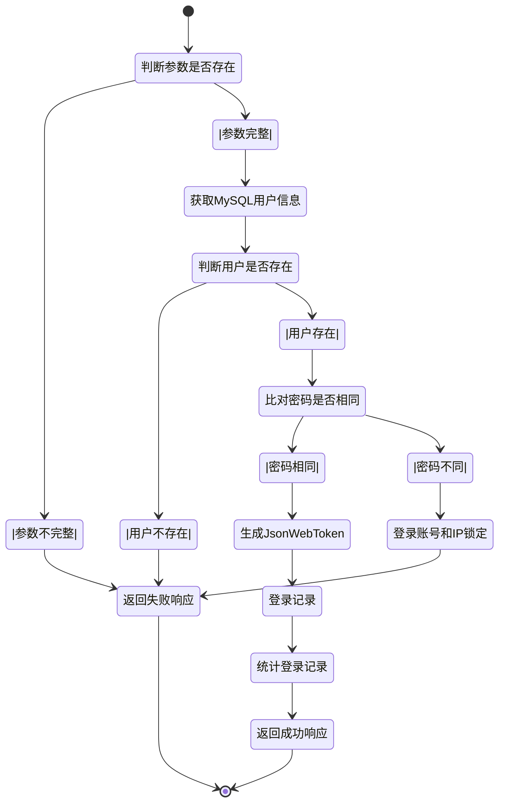

```mermaid
stateDiagram-v2
    [*] --> 判断参数是否存在
    判断参数是否存在 -->|参数不完整|
    |参数不完整| --> 返回失败响应
    判断参数是否存在 -->|参数完整|
    |参数完整| --> 获取MySQL用户信息
    获取MySQL用户信息 --> 判断用户是否存在
    判断用户是否存在 -->|用户不存在|
    |用户不存在| -->返回失败响应
    判断用户是否存在 -->|用户存在|
    |用户存在| -->比对密码是否相同
    比对密码是否相同 -->|密码相同|
    |密码相同| -->生成JsonWebToken
    生成JsonWebToken --> 登录记录
    登录记录 --> 统计登录记录
    统计登录记录 --> 返回成功响应
    比对密码是否相同 -->|密码不同|
    |密码不同| -->登录账号和IP锁定
    登录账号和IP锁定 --> 返回失败响应
    返回成功响应 --> [*]
    返回失败响应 --> [*]
```
