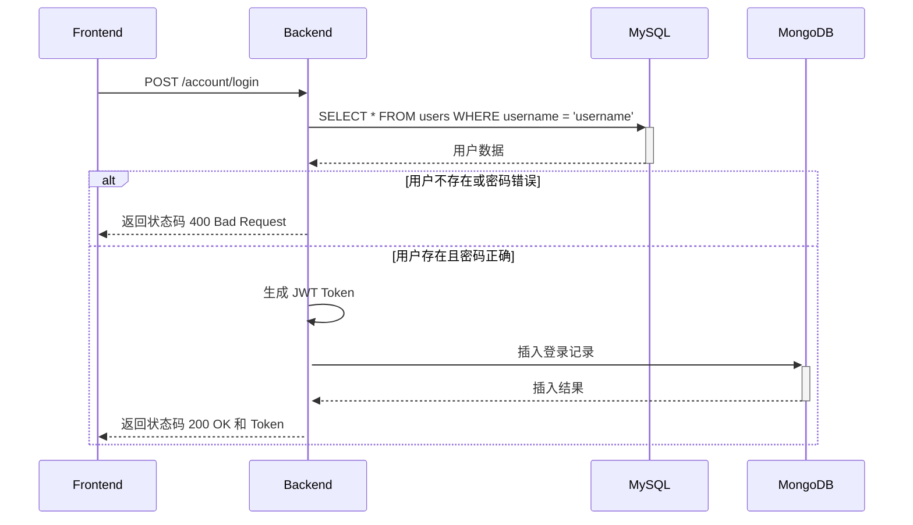

```mermaid
sequenceDiagram
    participant Frontend
    participant Backend
    participant MySQL
    participant MongoDB

    Frontend->>Backend: POST /account/login
    Backend->>+MySQL: SELECT * FROM users WHERE username = 'username'
    MySQL-->>-Backend: 用户数据
    alt 用户不存在或密码错误
        Backend-->>Frontend: 返回状态码 400 Bad Request
    else 用户存在且密码正确
        Backend->>+Backend: 生成 JWT Token
        Backend->>+MongoDB: 插入登录记录
        MongoDB-->>-Backend: 插入结果
        Backend-->>Frontend: 返回状态码 200 OK 和 Token
    end

```
