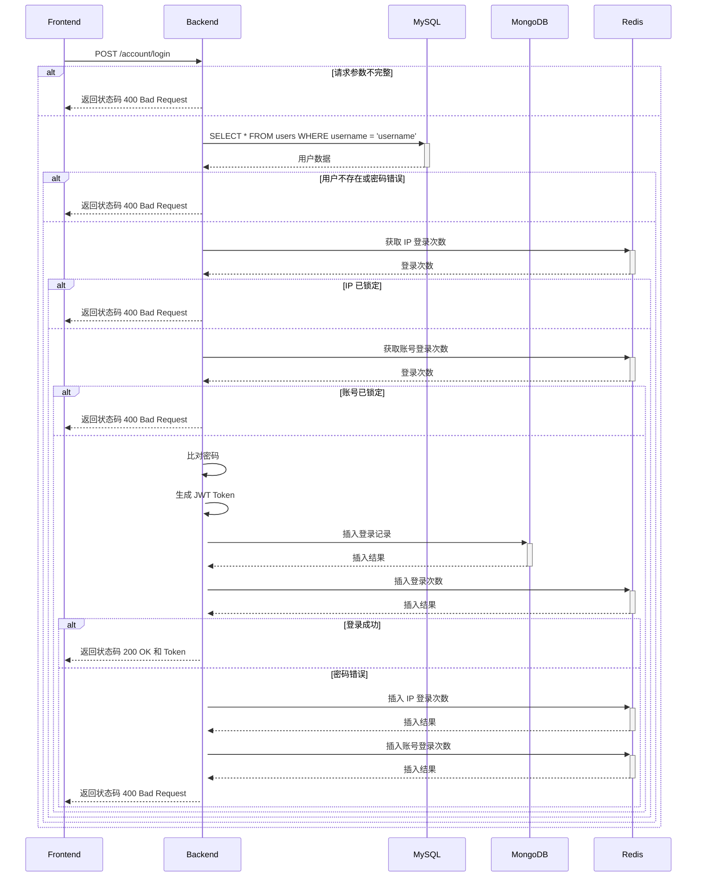

```mermaid
sequenceDiagram
    participant Frontend
    participant Backend
    participant MySQL
    participant MongoDB
    participant Redis

    Frontend->>Backend: POST /account/login
    alt 请求参数不完整
        Backend-->>Frontend: 返回状态码 400 Bad Request
    else
        Backend->>+MySQL: SELECT * FROM users WHERE username = 'username'
        MySQL-->>-Backend: 用户数据
        alt 用户不存在或密码错误
            Backend-->>Frontend: 返回状态码 400 Bad Request
        else
            Backend->>+Redis: 获取 IP 登录次数
            Redis-->>-Backend: 登录次数
            alt IP 已锁定
                Backend-->>Frontend: 返回状态码 400 Bad Request
            else
                Backend->>+Redis: 获取账号登录次数
                Redis-->>-Backend: 登录次数
                alt 账号已锁定
                    Backend-->>Frontend: 返回状态码 400 Bad Request
                else
                    Backend->>+Backend: 比对密码
                    Backend->>+Backend: 生成 JWT Token
                    Backend->>+MongoDB: 插入登录记录
                    MongoDB-->>-Backend: 插入结果
                    Backend->>+Redis: 插入登录次数
                    Redis-->>-Backend: 插入结果
                    alt 登录成功
                        Backend-->>Frontend: 返回状态码 200 OK 和 Token
                    else 密码错误
                        Backend->>+Redis: 插入 IP 登录次数
                        Redis-->>-Backend: 插入结果
                        Backend->>+Redis: 插入账号登录次数
                        Redis-->>-Backend: 插入结果
                        Backend-->>Frontend: 返回状态码 400 Bad Request
                    end
                end
            end
        end
    end


```
