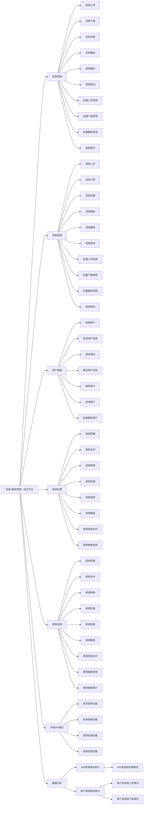

```mermaid
flowchart LR;
A[悦音-媒体管理一站式平台]-->B[音频管理];
B-->BA[音频上传];
B-->BB[音频下载];
B-->BC[音频设置];
B-->BD[音频播放];
B-->BE[音频删除];
B-->BF[音频查询];
B-->BG[批量上传音频];
B-->BH[批量下载音频];
B-->BI[批量删除音频];
B-->BJ[音频转码];
A-->C[视频管理];
C-->CA[视频上传];
C-->CB[视频下载];
C-->CC[视频设置];
C-->CD[视频播放];
C-->CE[视频删除];
C-->CF[视频查询];
C-->CG[批量上传视频];
C-->CH[批量下载视频];
C-->CI[批量删除视频];
C-->CJ[视频转码];
A-->D[用户管理];
D-->DA[新增用户];
D-->DB[修改用户信息];
D-->DC[修改密码];
D-->DD[修改用户状态];
D-->DE[删除用户];
D-->DF[查询用户];
D-->DG[批量删除用户];
A-->E[音频处理];
E-->EA[音频剪辑];
E-->EB[音频合并];
E-->EC[音频转换];
E-->ED[音频压缩];
E-->EE[音频加密];
E-->EF[音频解密];
E-->EG[音频添加水印];
E-->EH[音频抽取音频];
A-->F[视频处理];
F-->FA[视频剪辑];
F-->FB[视频合并];
F-->FC[视频转换];
F-->FD[视频压缩];
F-->FE[视频加密];
F-->FF[视频解密];
F-->FG[视频添加水印];
F-->FH[视频抽取音频];
F-->FI[视频抽取图片];
A-->G[开放API接口];
G-->GA[共享音频功能];
G-->GB[共享视频功能];
G-->GC[音频处理功能];
G-->GD[视频处理功能];
A-->H[数据分析];
H-->HA[API使用情况统计];
HA-->HAA[API音视频处理情况];
H-->HB[用户使用情况统计];
HB-->HBA[用户音视频上传情况];
HB-->HBB[用户音视频下载情况];

```
