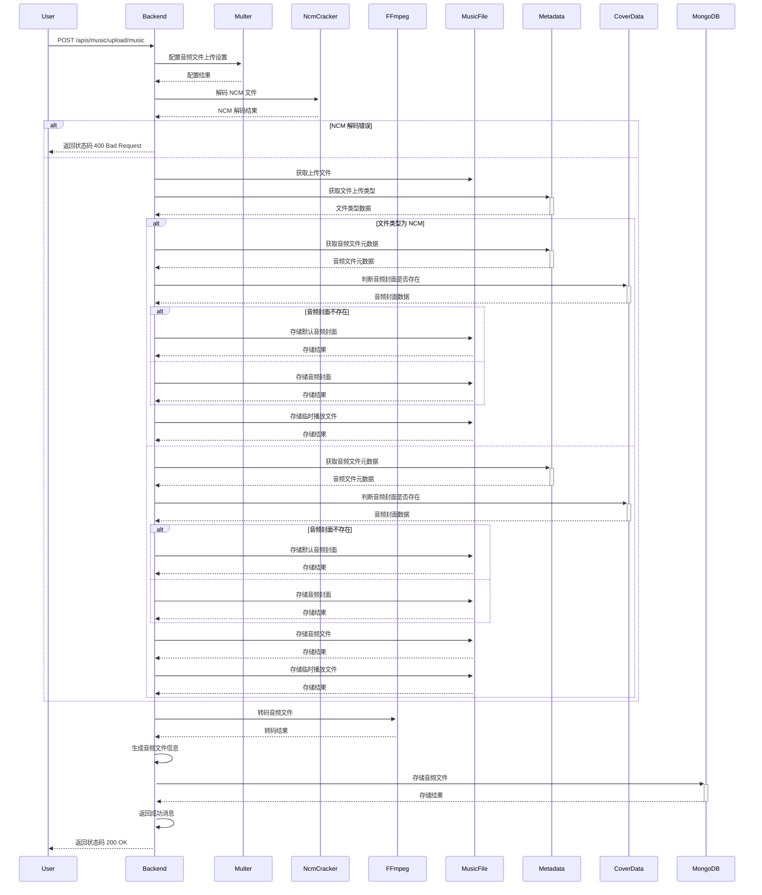

```mermaid
sequenceDiagram
    participant User
    participant Backend
    participant Multer
    participant NcmCracker
    participant FFmpeg
    participant MusicFile
    participant Metadata
    participant CoverData

    User->>Backend: POST /apis/music/upload/music
    Backend->>+Multer: 配置音频文件上传设置
    Multer-->>Backend: 配置结果
    Backend->>+NcmCracker: 解码 NCM 文件
    NcmCracker-->>Backend: NCM 解码结果
    alt NCM 解码错误
        Backend-->>User: 返回状态码 400 Bad Request
    else
        Backend->>+MusicFile: 获取上传文件
        Backend->>+Metadata: 获取文件上传类型
        Metadata-->>-Backend: 文件类型数据
        alt 文件类型为 NCM
            Backend->>+Metadata: 获取音频文件元数据
            Metadata-->>-Backend: 音频文件元数据
            Backend->>+CoverData: 判断音频封面是否存在
            CoverData-->>-Backend: 音频封面数据
            alt 音频封面不存在
                Backend->>+MusicFile: 存储默认音频封面
                MusicFile-->>Backend: 存储结果
            else
                Backend->>+MusicFile: 存储音频封面
                MusicFile-->>Backend: 存储结果
            end
            Backend->>+MusicFile: 存储临时播放文件
            MusicFile-->>Backend: 存储结果
        else
            Backend->>+Metadata: 获取音频文件元数据
            Metadata-->>-Backend: 音频文件元数据
            Backend->>+CoverData: 判断音频封面是否存在
            CoverData-->>-Backend: 音频封面数据
            alt 音频封面不存在
                Backend->>+MusicFile: 存储默认音频封面
                MusicFile-->>Backend: 存储结果
            else
                Backend->>+MusicFile: 存储音频封面
                MusicFile-->>Backend: 存储结果
            end
            Backend->>+MusicFile: 存储音频文件
            MusicFile-->>Backend: 存储结果
            Backend->>+MusicFile: 存储临时播放文件
            MusicFile-->>Backend: 存储结果
        end
    end
    Backend->>+FFmpeg: 转码音频文件
    FFmpeg-->>Backend: 转码结果
    Backend->>+Backend: 生成音频文件信息
    Backend->>+MongoDB: 存储音频文件
    MongoDB-->>-Backend: 存储结果
    Backend->>+Backend: 返回成功消息
    Backend-->>User: 返回状态码 200 OK
```
