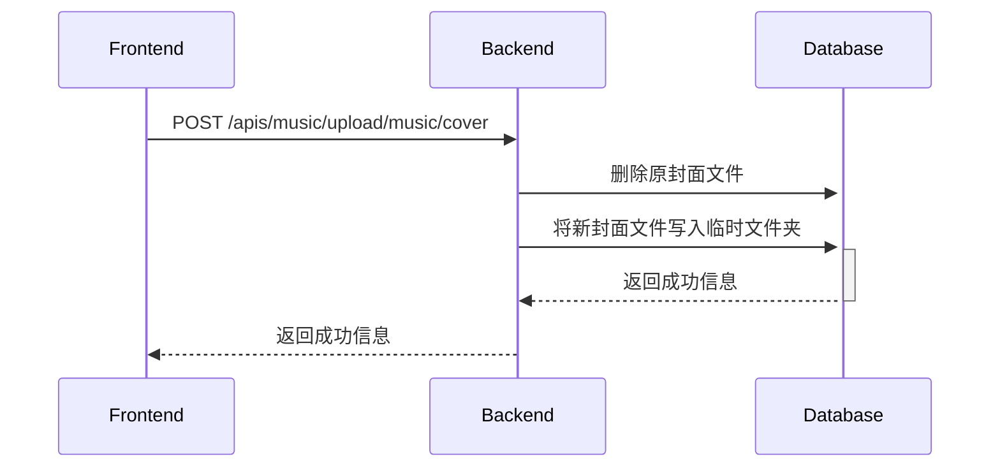

```mermaid
sequenceDiagram
    participant Frontend
    participant Backend
    participant Database

    Frontend->>Backend: POST /apis/music/upload/music/cover
    Backend->>+Database: 删除原封面文件
    Backend->>+Database: 将新封面文件写入临时文件夹
    Database-->>-Backend: 返回成功信息
    Backend-->>Frontend: 返回成功信息
```
