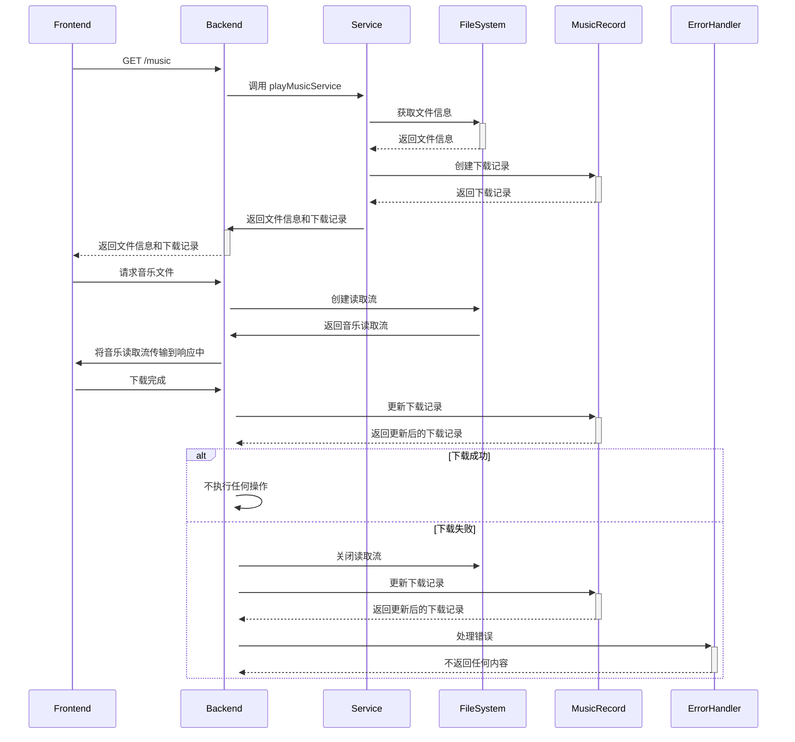

```mermaid
sequenceDiagram
    participant Frontend
    participant Backend
    participant Service
    participant FileSystem
    participant MusicRecord
    participant ErrorHandler

    Frontend->>+Backend: GET /music
    Backend->>+Service: 调用 playMusicService
    Service->>+FileSystem: 获取文件信息
    FileSystem-->>-Service: 返回文件信息
    Service->>+MusicRecord: 创建下载记录
    MusicRecord-->>-Service: 返回下载记录
    Service->>+Backend: 返回文件信息和下载记录
    Backend-->>-Frontend: 返回文件信息和下载记录
    Frontend->>+Backend: 请求音乐文件
    Backend->>+FileSystem: 创建读取流
    FileSystem->>+Backend: 返回音乐读取流
    Backend->>+Frontend: 将音乐读取流传输到响应中
    Frontend->>+Backend: 下载完成
    Backend->>+MusicRecord: 更新下载记录
    MusicRecord-->>-Backend: 返回更新后的下载记录
    alt 下载成功
        Backend->>+Backend: 不执行任何操作
    else 下载失败
        Backend->>+FileSystem: 关闭读取流
        Backend->>+MusicRecord: 更新下载记录
        MusicRecord-->>-Backend: 返回更新后的下载记录
        Backend->>+ErrorHandler: 处理错误
        ErrorHandler-->>-Backend: 不返回任何内容
    end
```
