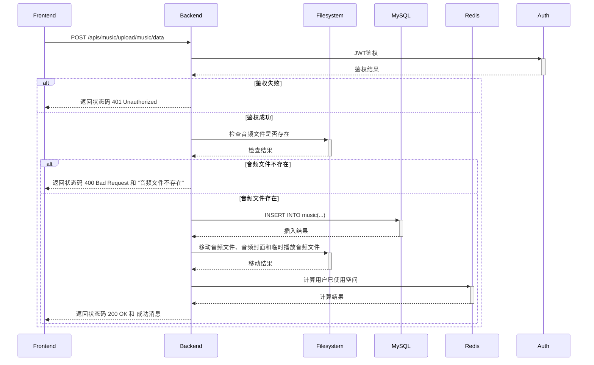

```mermaid
sequenceDiagram
    participant Frontend
    participant Backend
    participant Filesystem
    participant MySQL
    participant Redis

    Frontend->>Backend: POST /apis/music/upload/music/data
    Backend->>+Auth: JWT鉴权
    Auth-->>-Backend: 鉴权结果
    alt 鉴权失败
        Backend-->>Frontend: 返回状态码 401 Unauthorized
    else 鉴权成功
        Backend->>+Filesystem: 检查音频文件是否存在
        Filesystem-->>-Backend: 检查结果
        alt 音频文件不存在
            Backend-->>Frontend: 返回状态码 400 Bad Request 和 "音频文件不存在"
        else 音频文件存在
            Backend->>+MySQL: INSERT INTO music(...)
            MySQL-->>-Backend: 插入结果
            Backend->>+Filesystem: 移动音频文件、音频封面和临时播放音频文件
            Filesystem-->>-Backend: 移动结果
            Backend->>+Redis: 计算用户已使用空间
            Redis-->>-Backend: 计算结果
            Backend-->>Frontend: 返回状态码 200 OK 和 成功消息
        end
    end
```
