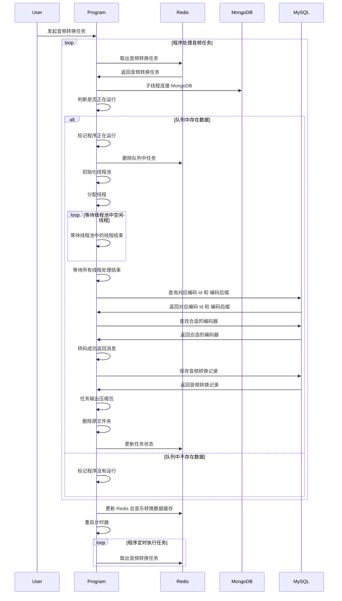

```mermaid
sequenceDiagram
    participant User
    participant Program
    participant Redis
    participant MongoDB
    participant MySQL
    User ->> Program: 发起音频转换任务
    loop 程序处理音频任务
        Program ->> Redis: 取出音频转换任务
        Redis ->> Program: 返回音频转换任务
        Program ->> MongoDB: 子线程连接 MongoDB
        Program ->> Program: 判断是否正在运行
        alt 队列中存在数据
            Program ->> Program: 标记程序正在运行
            Program ->> Redis: 删除队列中任务
            Program ->> Program: 初始化线程池
            Program ->> Program: 分配线程
            loop 等待线程池中空闲线程
                Program ->> Program: 等待线程池中的线程结束
            end
            Program ->> Program: 等待所有线程处理结束
            Program ->> MySQL: 查询对应编码 Id 和 编码后缀
            MySQL ->> Program: 返回对应编码 Id 和 编码后缀
            Program ->> MySQL: 查找合适的编码器
            MySQL ->> Program: 返回合适的编码器
            Program ->> Program: 转码成功返回消息
            Program ->> MySQL: 保存音频转换记录
            MySQL ->> Program: 返回音频转换记录
            Program ->> Program: 任务输出压缩包
            Program ->> Program: 删除原文件夹
            Program ->> Redis: 更新任务状态
        else 队列中不存在数据
            Program ->> Program: 标记程序没有运行
        end
    end
    Program ->> Redis: 更新 Redis 总音乐转换数据缓存
    Program ->> Program: 重启计时器
    loop 程序定时执行任务
        Program ->> Redis: 取出音频转换任务
    end
```
