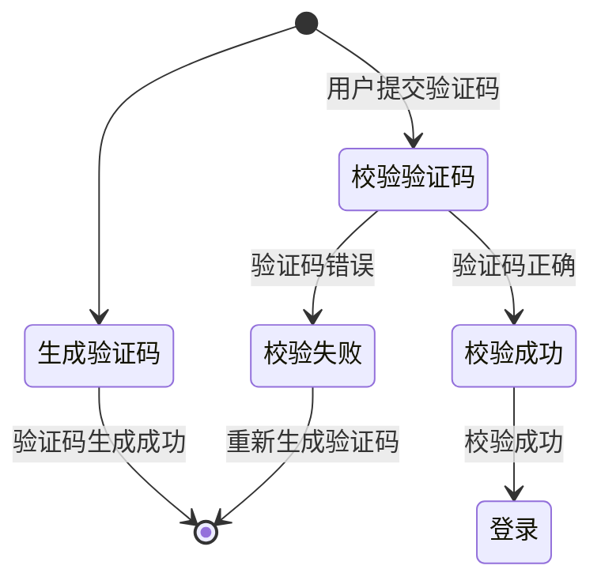

```mermaid
stateDiagram
    [*] --> 生成验证码
    生成验证码 --> [*]: 验证码生成成功

    [*] --> 校验验证码: 用户提交验证码
    校验验证码 --> 校验成功: 验证码正确
    校验验证码 --> 校验失败: 验证码错误
    校验失败 --> [*]: 重新生成验证码
    校验成功 --> 登录: 校验成功
```
