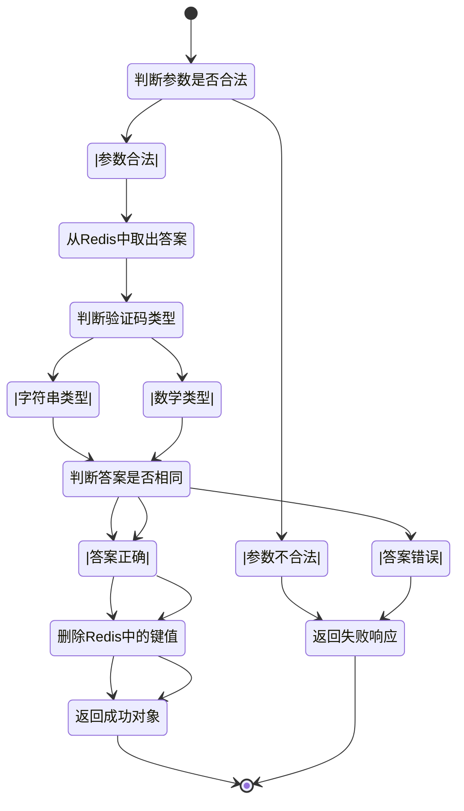

```mermaid
stateDiagram-v2
    [*] --> 判断参数是否合法
    判断参数是否合法 -->|参数不合法|
    |参数不合法| --> 返回失败响应
    判断参数是否合法 -->|参数合法|
    |参数合法| --> 从Redis中取出答案
    从Redis中取出答案 --> 判断验证码类型
    判断验证码类型 -->|字符串类型|
    |字符串类型| --> 判断答案是否相同
    判断答案是否相同 -->|答案正确|
    |答案正确| --> 删除Redis中的键值
    删除Redis中的键值 --> 返回成功对象
    |答案错误| --> 返回失败响应
    判断验证码类型 -->|数学类型|
    |数学类型| --> 判断答案是否相同
    判断答案是否相同 -->|答案正确|
    |答案正确| --> 删除Redis中的键值
    删除Redis中的键值 --> 返回成功对象
    判断答案是否相同 -->|答案错误|
    返回成功对象 --> [*]
    返回失败响应 --> [*]
```
