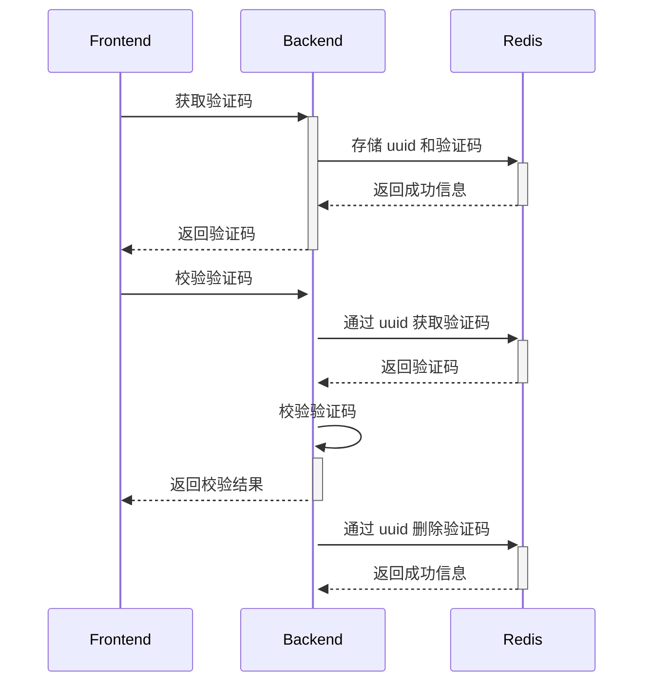

```mermaid
sequenceDiagram
    participant Frontend
    participant Backend
    participant Redis
    Frontend->>+Backend: 获取验证码
    Backend->>+Redis: 存储 uuid 和验证码
    Redis-->>-Backend: 返回成功信息
    Backend-->>-Frontend: 返回验证码
    Frontend->>+Backend: 校验验证码
    Backend->>+Redis: 通过 uuid 获取验证码
    Redis-->>-Backend: 返回验证码
    Backend->>+Backend: 校验验证码
    Backend-->>-Frontend: 返回校验结果
    Backend->>+Redis: 通过 uuid 删除验证码
    Redis-->>-Backend: 返回成功信息
```
