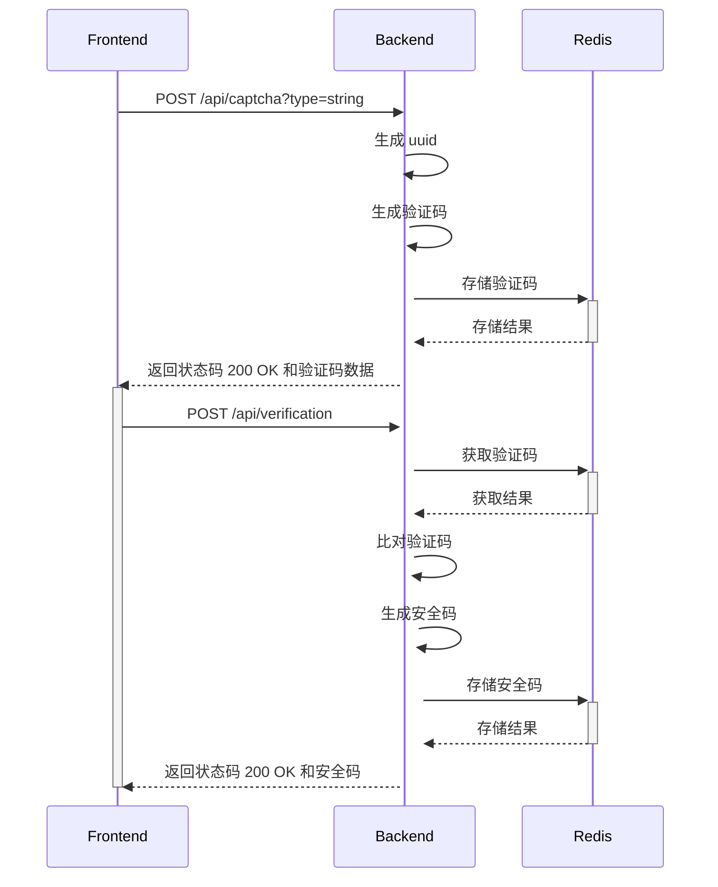

```mermaid
sequenceDiagram
    participant Frontend
    participant Backend
    participant Redis

    Frontend->>Backend: POST /api/captcha?type=string
    Backend->>+Backend: 生成 uuid
    Backend->>+Backend: 生成验证码
    Backend->>+Redis: 存储验证码
    Redis-->>-Backend: 存储结果
    Backend-->>Frontend: 返回状态码 200 OK 和验证码数据

    activate Frontend
    Frontend->>Backend: POST /api/verification
    Backend->>+Redis: 获取验证码
    Redis-->>-Backend: 获取结果
    Backend->>+Backend: 比对验证码
    Backend->>+Backend: 生成安全码
    Backend->>+Redis: 存储安全码
    Redis-->>-Backend: 存储结果
    Backend-->>Frontend: 返回状态码 200 OK 和安全码
    deactivate Frontend
```
