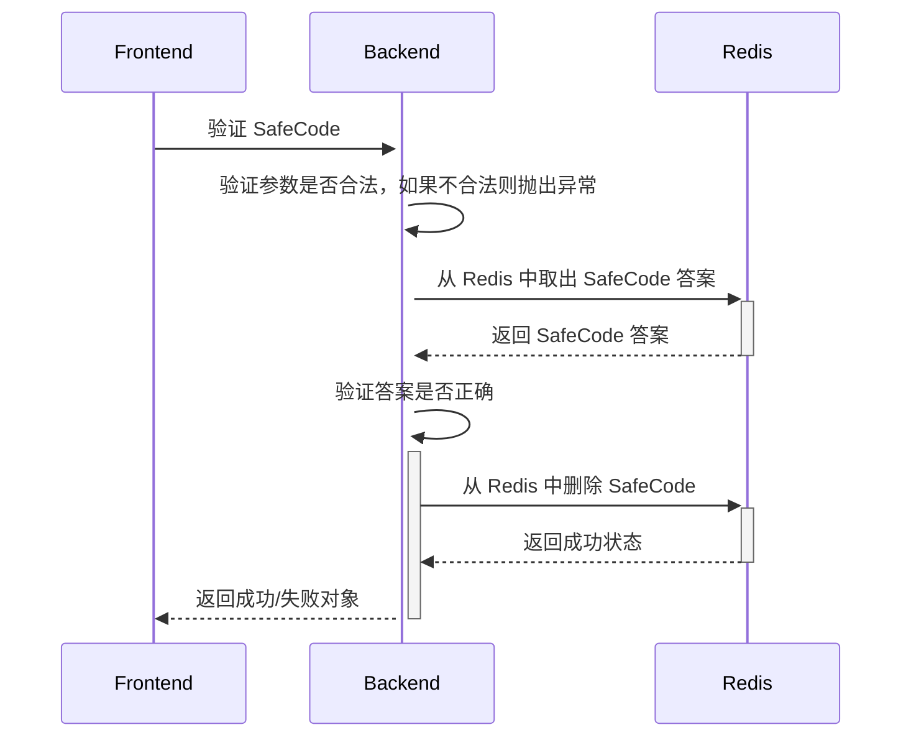

```mermaid
sequenceDiagram
    participant Frontend
    participant Backend
    participant Redis
    Frontend->>+Backend: 验证 SafeCode
    Backend->>+Backend: 验证参数是否合法，如果不合法则抛出异常
    Backend->>+Redis: 从 Redis 中取出 SafeCode 答案
    Redis-->>-Backend: 返回 SafeCode 答案
    Backend->>+Backend: 验证答案是否正确
    Backend->>+Redis: 从 Redis 中删除 SafeCode
    Redis-->>-Backend: 返回成功状态
    Backend-->>-Frontend: 返回成功/失败对象
```
