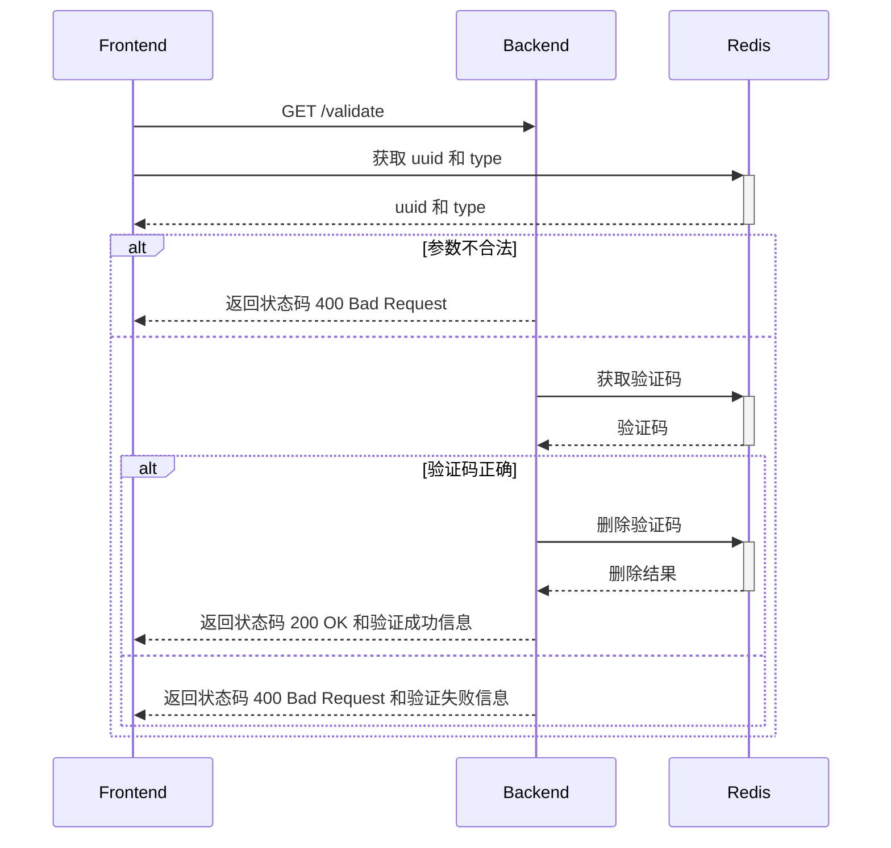

```mermaid
sequenceDiagram
    participant Frontend
    participant Backend
    participant Redis

    Frontend->>Backend: GET /validate
    Frontend->>+Redis: 获取 uuid 和 type
    Redis-->>-Frontend: uuid 和 type
    alt 参数不合法
        Backend-->>Frontend: 返回状态码 400 Bad Request
    else
        Backend->>+Redis: 获取验证码
        Redis-->>-Backend: 验证码
        alt 验证码正确
            Backend->>+Redis: 删除验证码
            Redis-->>-Backend: 删除结果
            Backend-->>Frontend: 返回状态码 200 OK 和验证成功信息
        else
            Backend-->>Frontend: 返回状态码 400 Bad Request 和验证失败信息
        end
    end

```
